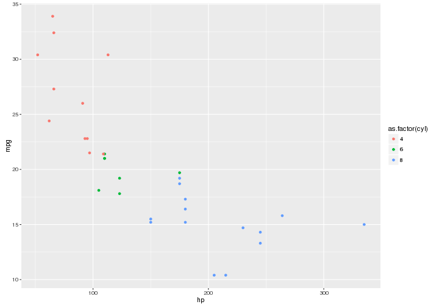

# Repository for the CIGENE R workshops. 
We used to have a R-lovers club, so this is a great opportunity to revive it. 

# Table of Contents
1. [dplyr example session Monday 25.01.16](#dplyr-example-session-monday)
2. [Preparation](#preparation)
3. [Built in Datasets](#built-in-datasets)
4. [Learning](#learning)

## dplyr example session Monday
1. Download this repository to your computer by clicking the Download Zip buttun. Unzip, change working directory to the folder and yoy will have the data ready to copy and paste from the file below. 
2. Navigate to https://github.com/timknut/r_workshops/blob/master/dplyr_parsing.Rmd and run the commands. 
3. Alternativly you can open the `dplyr_parsing.Rmd`file directly and run the commands from that script.


## Preparation
To prepare for this, I suggest that you find yourself some data, and try to solve some problems.
eg:

* read the data into R. 
* select columns to new data frame.
* filter the new df based on a column. 
* Make a new column by adding two other columns together. 
* summarize the data by eg. grouping by a column  and showing the mean for each group.
* Plot your results using ggplot2. http://www.cookbook-r.com/Graphs/index.html 

## Built in Datasets:
* Use the built in datasets i R:


```r
if(!require(ggplot2)) install.packages("ggplot2")
cars <- mtcars
flowers <- iris
diamonds <- ggplot2::diamonds

ggplot2::ggplot(cars, aes(hp, mpg)) + 
	geom_point(aes(colour = as.factor(cyl)))
```

 

## Learning:
There a many, many books and resources. It is easy to get lost. Find a good source, and stick to it. Also, google will solve almost everything. 
For the basics, I really like http://www.statmethods.net/ . This has examples for doing 90 % of the most basic stuff you need to do.


## Version control with git and github.
If you are going to write a lot of code, I really, REALLY recommend reading about version control with git and how it can help you organize, backup, collaborate and share your code. [This article gives an overview.](http://journals.plos.org/ploscompbiol/article?id=10.1371/journal.pcbi.1004668) There are many other tutorials out there. Just google around if you feel for it. If you master git, you will be ahead of your teckno-conservative project leader.  

### Hadley
For this workshop, we can go through how to do a rna-seq basic analysis using Hadley Wickams package dplyr which I find immensely useful. https://github.com/hadley/dplyr 
He has created small intro tutorial using a built in dataset. 
https://cran.r-project.org/web/packages/dplyr/vignettes/introduction.html  

### Videos
If you like videos, I think this course is easy to understand and explained well. http://varianceexplained.org/RData/ 

If you REALLY like videos, go for one of these full blown online courses: https://www.coursera.org/learn/r-programming 
https://www.coursera.org/learn/data-cleaning and see related courses. 
